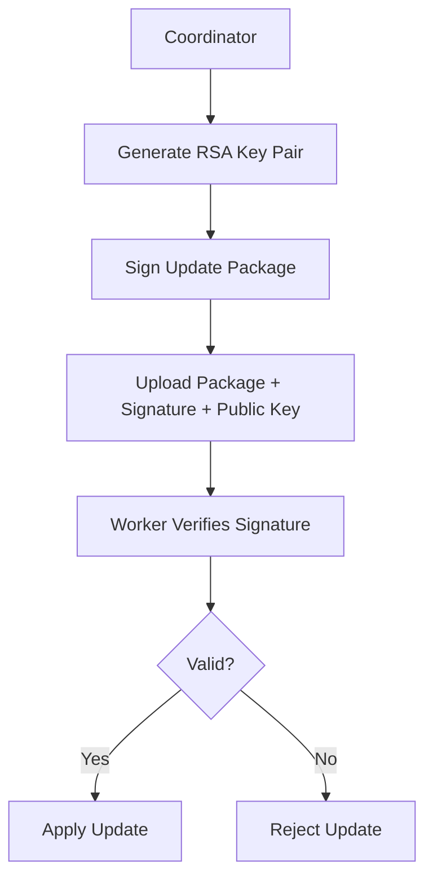

# Security Hardening for Version Management

## Overview

The version management system includes comprehensive security hardening features to ensure the integrity and authenticity of update packages in production deployments. This document covers digital signature verification, key management, and security best practices.

## Digital Signature Verification

### Architecture

The system implements RSA-based digital signatures for update packages using SHA-256 hashing and PKCS#1 v1.5 padding. This provides cryptographic assurance that update packages have not been tampered with and originate from a trusted source.



### Key Management

#### Key Generation
```bash
# Generate signing keys
./translator keygen --output-dir /etc/translator/keys
```

This creates:
- `translator-signing-key.pem` (private key, 0600 permissions)
- `translator-signing-key.pub` (public key, 0644 permissions)

#### Key Storage
- **Private Key**: Stored securely on coordinator, never distributed
- **Public Key**: Distributed with update packages for verification
- **Permissions**: Private key restricted to owner, public key world-readable

### Signing Process

#### Package Signing
```go
// Create signed update package
signedPackage, err := vm.createSignedUpdatePackage(privateKeyPath)
```

1. **Hash Package**: SHA-256 hash of entire package contents
2. **Sign Hash**: RSA private key signing with PKCS#1 v1.5
3. **Create Signature File**: Base64-encoded signature saved as `.sig` file

#### Signature Verification
```go
// Verify package signature
err := vm.verifyUpdatePackage(packagePath, signaturePath, publicKeyPath)
```

1. **Load Public Key**: Parse RSA public key from PEM format
2. **Hash Package**: Recalculate SHA-256 hash
3. **Verify Signature**: RSA verification against provided signature

### Update Workflow with Signatures

#### Coordinator Side
```go
// Create signed update
err := vm.UpdateWorkerWithSigning(ctx, service, privateKeyPath, publicKeyPath)
```

#### Worker Side Verification
```go
// Before applying update, verify signature
if err := verifyUpdateSignature(packagePath, sigPath, pubKeyPath); err != nil {
    return fmt.Errorf("signature verification failed: %w", err)
}
```

## Security Features

### Cryptographic Security
- **Algorithm**: RSA-2048 with SHA-256
- **Padding**: PKCS#1 v1.5 (secure for signing)
- **Key Size**: 2048 bits (recommended minimum)
- **Hash Function**: SHA-256 (collision resistant)

### Integrity Protection
- **Full Package Hashing**: Entire package contents hashed
- **Signature Verification**: Mandatory before update application
- **Tamper Detection**: Any modification invalidates signature

### Access Control
- **Private Key Protection**: File permissions restrict access
- **Signature Required**: Updates without valid signatures rejected
- **Key Rotation**: Support for periodic key rotation

## Configuration

### Coordinator Configuration
```yaml
version_manager:
  signing:
    enabled: true
    private_key_path: "/etc/translator/keys/translator-signing-key.pem"
    public_key_path: "/etc/translator/keys/translator-signing-key.pub"
    key_size: 2048
  security:
    require_signatures: true
    signature_timeout: 300s
```

### Worker Configuration
```yaml
update:
  security:
    require_signature_verification: true
    trusted_public_keys:
      - "/etc/translator/keys/trusted-signing-key.pub"
    signature_cache_ttl: 3600s
```

## API Endpoints

### Key Management
```
POST /api/v1/security/keys/generate
```
Generate new signing key pair.

**Request:**
```json
{
  "key_size": 2048,
  "output_dir": "/etc/translator/keys"
}
```

**Response:**
```json
{
  "private_key_path": "/etc/translator/keys/translator-signing-key.pem",
  "public_key_path": "/etc/translator/keys/translator-signing-key.pub",
  "fingerprint": "SHA256:abc123..."
}
```

### Signature Verification
```
POST /api/v1/security/verify-signature
```
Verify signature of a package.

**Request:**
```json
{
  "package_path": "/tmp/update.tar.gz",
  "signature_path": "/tmp/update.tar.gz.sig",
  "public_key_path": "/etc/translator/keys/trusted-key.pub"
}
```

**Response:**
```json
{
  "verified": true,
  "algorithm": "RSA-SHA256",
  "timestamp": "2024-01-01T12:00:00Z"
}
```

### Signed Updates
```
POST /api/v1/update/signed
```
Upload signed update package.

**Headers:**
- `X-Signature-Algorithm: RSA-SHA256`
- `X-Public-Key-Fingerprint: SHA256:abc123...`

## Key Rotation

### Rotation Process
1. **Generate New Keys**: Create new RSA key pair
2. **Sign Transition Package**: Sign package with both old and new keys
3. **Deploy Transition**: Update workers with new public key
4. **Switch Keys**: Coordinator begins using new private key
5. **Cleanup**: Remove old private key after grace period

### Automated Rotation
```bash
# Rotate keys monthly
0 2 1 * * /usr/local/bin/translator key-rotate --grace-period 30d
```

## Monitoring & Auditing

### Security Events
- `signature_verification_success`
- `signature_verification_failure`
- `key_rotation_completed`
- `unauthorized_update_attempt`

### Metrics
- Signature verification success/failure rates
- Key rotation frequency
- Update package integrity checks

### Audit Logging
```json
{
  "timestamp": "2024-01-01T12:00:00Z",
  "event": "signature_verification_success",
  "worker_id": "worker-01",
  "package_hash": "sha256:abc123...",
  "signature_algorithm": "RSA-SHA256",
  "public_key_fingerprint": "SHA256:def456..."
}
```

## Threat Model

### Attack Vectors Mitigated

#### Package Tampering
- **Attack**: Malicious modification of update packages
- **Mitigation**: Digital signatures prevent undetected changes
- **Detection**: Signature verification fails on tampered packages

#### Man-in-the-Middle
- **Attack**: Interception and modification during transit
- **Mitigation**: HTTPS transport + signature verification
- **Detection**: Signature verification at worker side

#### Unauthorized Updates
- **Attack**: Deployment of malicious updates
- **Mitigation**: Private key protection + signature requirements
- **Detection**: Audit logging of all update attempts

#### Key Compromise
- **Attack**: Theft of private signing key
- **Mitigation**: Key rotation + offline storage
- **Recovery**: Emergency key revocation and rotation

### Residual Risks

#### Implementation Bugs
- **Risk**: Cryptographic implementation flaws
- **Mitigation**: Code review + third-party library validation
- **Monitoring**: Automated testing + security scanning

#### Side Channel Attacks
- **Risk**: Timing attacks on signature verification
- **Mitigation**: Constant-time cryptographic operations
- **Monitoring**: Performance monitoring for anomalies

## Compliance

### Security Standards
- **NIST SP 800-57**: Key Management Guidelines
- **FIPS 186-4**: Digital Signature Standard
- **RFC 3447**: PKCS#1 RSA Cryptography Specifications

### Regulatory Compliance
- **PCI DSS**: Secure key management for payment systems
- **SOX**: Audit trails for financial systems
- **HIPAA**: Secure updates for healthcare systems

## Best Practices

### Key Management
1. **Generate keys offline** on secure systems
2. **Store private keys** in HSMs or encrypted storage
3. **Rotate keys regularly** (quarterly minimum)
4. **Backup keys securely** with encryption
5. **Monitor key usage** and access patterns

### Update Security
1. **Always sign packages** before distribution
2. **Verify signatures** before application
3. **Use secure transport** (HTTPS/TLS 1.3)
4. **Implement rate limiting** on update endpoints
5. **Log all security events** for auditing

### Operational Security
1. **Limit coordinator access** to authorized personnel
2. **Implement least privilege** for service accounts
3. **Regular security audits** of update processes
4. **Monitor for anomalies** in update patterns
5. **Have incident response** plans for key compromise

## Troubleshooting

### Signature Verification Failures

#### Invalid Signature
```
Error: signature verification failed: crypto/rsa: verification error
```

**Causes:**
- Package tampered during transit
- Wrong public key used for verification
- Corrupted signature file

**Resolution:**
1. Check package integrity: `sha256sum package.tar.gz`
2. Verify correct public key is being used
3. Regenerate signature if package was rebuilt

#### Missing Signature File
```
Error: failed to read signature file: no such file or directory
```

**Resolution:**
1. Ensure signature file accompanies package
2. Check file upload process
3. Verify worker can access signature files

### Key Management Issues

#### Permission Denied
```
Error: failed to read private key: permission denied
```

**Resolution:**
1. Check file permissions: `ls -la /etc/translator/keys/`
2. Ensure correct ownership: `chown translator:translator private-key.pem`
3. Set restrictive permissions: `chmod 0600 private-key.pem`

#### Invalid Key Format
```
Error: failed to parse private key: invalid PEM format
```

**Resolution:**
1. Verify PEM headers: `head -2 key.pem`
2. Check for corruption: `openssl rsa -in key.pem -noout`
3. Regenerate keys if corrupted

## Future Enhancements

### Advanced Features
- **Hardware Security Modules (HSM)**: Store keys in dedicated hardware
- **Certificate-based Signing**: X.509 certificate chains
- **Multi-signature Requirements**: Require multiple signatures
- **Timestamp Authorities**: Prevent replay attacks
- **Automated Key Rotation**: Policy-based key lifecycle management

### Integration Features
- **Kubernetes Integration**: Native K8s secret management
- **AWS KMS Integration**: Cloud-based key management
- **Azure Key Vault**: Microsoft cloud integration
- **HashiCorp Vault**: Enterprise key management

---

## Quick Reference

### Generate Keys
```bash
./translator keygen --dir /etc/translator/keys --size 2048
```

### Sign Package
```bash
./translator sign-package \
  --package update.tar.gz \
  --private-key /etc/translator/keys/private.pem \
  --output update.tar.gz.sig
```

### Verify Signature
```bash
./translator verify-package \
  --package update.tar.gz \
  --signature update.tar.gz.sig \
  --public-key /etc/translator/keys/public.pub
```

### Emergency Key Rotation
```bash
# Generate emergency keys
./translator keygen --emergency --dir /tmp/emergency-keys

# Deploy new public key to all workers
./translator deploy-public-key --key /tmp/emergency-keys/public.pub

# Switch to new private key
./translator switch-key --private-key /tmp/emergency-keys/private.pem
```

This security hardening implementation provides enterprise-grade protection for the distributed update system, ensuring that only authenticated and untampered updates can be deployed to production workers.